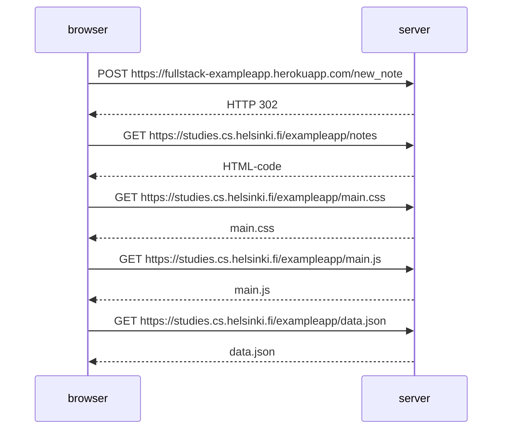
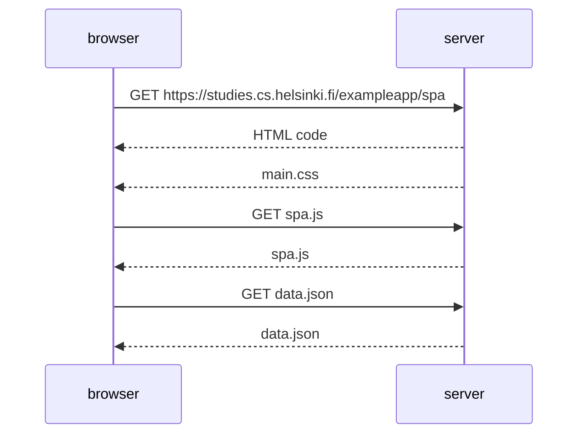
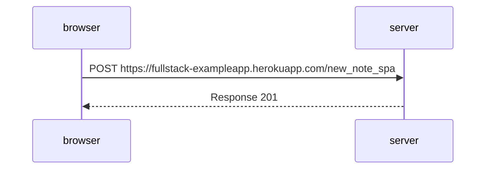

Fullstack part0

Ejercicio 0.4 

```mermaid
sequenceDiagram
    participant browser
    participant server

    browser->>server: POST https://fullstack-exampleapp.herokuapp.com/new_note
    server-->>browser: HTTP 302
    browser->>server: GET https://studies.cs.helsinki.fi/exampleapp/notes
    server-->>browser: HTML-code

    browser->>server: GET https://studies.cs.helsinki.fi/exampleapp/main.css
    server-->>browser: main.css

    browser->>server: GET https://studies.cs.helsinki.fi/exampleapp/main.js
    server-->>browser: main.js

    browser->>server: GET https://studies.cs.helsinki.fi/exampleapp/data.json
    server-->>browser: data.json
```

Ejercicio 0.5

```mermaid
sequenceDiagram
    participant browser
    participant server

    browser->>server: GET https://studies.cs.helsinki.fi/exampleapp/spa
    server-->>browser: HTML code
    server-->>browser: main.css
    browser->>server: GET spa.js
    server-->>browser: spa.js
    browser->>server: GET data.json
    server-->>browser: data.json
```
Ejercicio 0.6 

```mermaid
sequenceDiagram
    participant browser
    participant server

    browser->>server: POST https://fullstack-exampleapp.herokuapp.com/new_note_spa
    server-->>browser: Response 201
```
